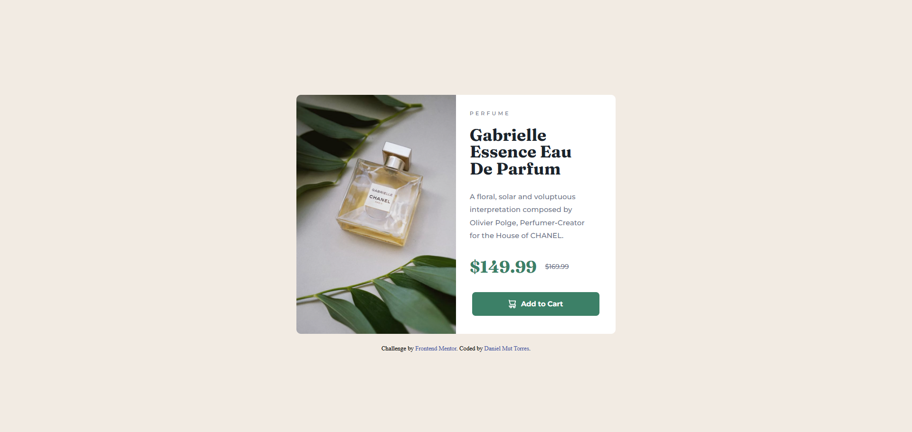

# Frontend Mentor - Product preview card component solution

This is a solution to the [Product preview card component challenge on Frontend Mentor](https://www.frontendmentor.io/challenges/product-preview-card-component-GO7UmttRfa). Frontend Mentor challenges help you improve your coding skills by building realistic projects. 

## Table of contents

- [Overview](#overview)
  - [The challenge](#the-challenge)
  - [Screenshot](#screenshot)
  - [Links](#links)
- [My process](#my-process)
  - [Built with](#built-with)
  - [What I learned](#what-i-learned)
  - [Continued development](#continued-development)
  - [Useful resources](#useful-resources)
- [Author](#author)
- [Acknowledgments](#acknowledgments)
## Overview

### The challenge

Users should be able to:

- View the optimal layout depending on their device's screen size
- See hover and focus states for interactive elements

### Screenshot



### Links

- Solution URL: [GitHub repo](https://github.com/danielMut02/Product-preview-card)
- Live Site URL: [Live solution](https://danielmut02.github.io/Product-preview-card/)

## My process

### Built with

- Semantic HTML5 markup
- CSS custom properties
- Flexbox
- Mobile-first workflow

### What I learned

Use this section to recap over some of your major learnings while working through this project. Writing these out and providing code samples of areas you want to highlight is a great way to reinforce your own knowledge.

In HTML I learned how to show two different images depending on the screen size.

```html
          <picture>
            <source srcset="./images/image-product-desktop.jpg" media="(width >= 460px)">
            
          </picture>
        </div>
```
In CSS I learnt how to apply the function min() to control the width of my element 

```css
.container {
  width: min(41rem, 700px);
}
```

### Continued development

In current projects I want to target Grid properties to continue enhancing my responsiveness abilities. Also, is my goal to develop projects including JavaScript, in order to make my websites more interactive. Later on, I will dive into JS frameworks and libraries such as ReactJS.

### Useful resources

- [DevDocs](https://devdocs.io/) - This is an amazing technical documentation site. It helped clarify some doubts I had on flex and responsiveness
- [w3schools](https://www.w3schools.com/) - This site helped with some code examples about making images responsive. Great when you don't know how to implement certain feature.

## Author

- Frontend Mentor - [@danielMut02](https://www.frontendmentor.io/profile/danielMut02)
- GitHub - [@danielMut02](https://github.com/danielMut02)

## Acknowledgments

Eternally thankful to freeCodeCamp since they served me as guidance for the web development career I am pursuing. Through their guided course for web developers I found a new passion! Also, my gratitude goes to Front End mentor for helping and creating such a wonderful platform to learn.
